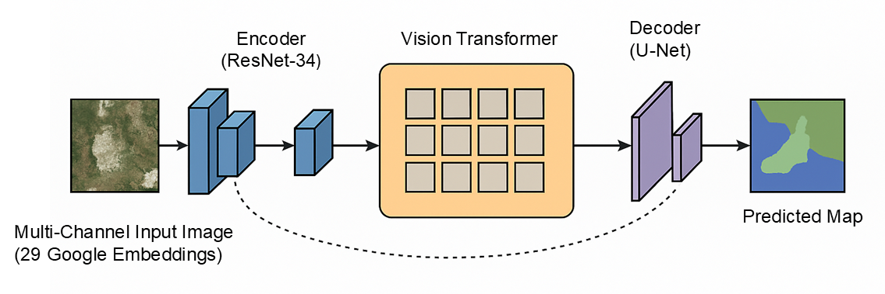

# Wetland Segmentation with ResUNet-ViT



This project performs high-resolution semantic segmentation of wetlands across Europe using a hybrid CNN-ViT architecture trained on 10-meter satellite imagery. It addresses the challenge of weak supervision from coarse-resolution 100-meter labels by applying label-aware loss weighting and boundary enhancement strategies to sharpen spatial accuracy at the native 10 m scale. The dataset exhibits strong class imbalance, which is handled through a combination of focal and class-weighted loss functions, improving minority class detection. It uses weak supervision from 100-meter wetland type labels and powerful spectral-temporal embeddings from Google’s Earth Engine dataset.

---

## 🌍 Datasets

### 🏣 Weak Supervision Labels

* **Source**: European Environment Agency (EEA)
* **Dataset**: [Wetland Types Dataset on EEA DataHub](https://www.eea.europa.eu/en/datahub/datahubitem-view/b9399908-557a-47a8-954a-958dabeaf1b6)
* **Coverage**: Europe-wide (EU countries + cooperating regions)
* **Resolution**: Rasterized to 100 m
* **Classes**: 18 original FAO Level-3 wetland types, remapped to 13 categories

### 🛋️ Input Features

* **Source**: [Google Earth Engine – Satellite Embedding v1](https://developers.google.com/earth-engine/datasets/catalog/GOOGLE_SATELLITE_EMBEDDING_V1_ANNUAL)
* **Type**: Spectral-temporal embeddings learned from Sentinel-1, Sentinel-2, Landsat, as described in Liu et al. (2022) *AlphaEarth: Accurate Land Cover Mapping via Scalable Vision Transformers* [arXiv:2507.22291v1](https://arxiv.org/abs/2507.22291)
* **Resolution**: 10 m
* **Bands Used**: 22 spectral-temporal bands (starting from Band 2)

---

## 📦 Project Structure

```bash
├── configs/                    # YAML configuration files
├── data/                       # Preprocessing, splitting, datasets, transforms
├── models/                     # ResUNet-ViT hybrid architecture
├── train/                      # Training logic, metrics, loss functions
├── predict/                    # Inference & evaluation
├── scripts/                    # Bash entrypoints, post-processing tools
├── outputs/                    # Saved checkpoints, logs, predictions
```

---

## 🚀 Quick Start

1. **Clone repository**:

```bash
git clone https://github.com/mkovac03/wetland-segmentation.git
cd wetland-segmentation
```

2. **Install requirements**:

```bash
pip install -r requirements.txt
```

3. **Start training**:

```bash
bash run_train.sh
```

4. **Run inference**:

```bash
python -m predict.inference --timestamp <TIMESTAMP>
```

---

## 🧠 Model Architecture

The segmentation model is a **ResNet-UNet-ViT hybrid**, purpose-built for **wetland mapping with high-dimensional satellite embeddings** and **weak supervision**. It integrates:

* **local texture encoding** via convolutional networks
* **global spatial context** using transformer-based attention
* **decoder with skip connections** for spatial detail preservation

This architecture excels at fine-resolution segmentation (10m) under coarse or noisy label constraints.

### 🔧 Key Components

**Encoder**:

* Based on a ResNet-34 backbone
* Accepts 22 input channels (from Band 2 onward)

**Transformer Bottleneck**:

* 4 attention layers, 8 heads, 512-dimensional embeddings
* Operates on 16×16 feature maps with patch size 2

**Decoder**:

* Upsampling path with skip connections
* Final segmentation output matches 512×512 patch size

---

## 🗂️ Tile Preparation & Label Mapping

Raw multi-band satellite images are reprojected, tiled into fixed-size patches, and aligned with remapped label masks. Background-heavy tiles are filtered out, and invalid classes are masked. All preprocessing logic, including CRS, patch size, stride, and label handling, is configured externally.

---

## 🧪 Data Augmentation

Augmentations applied during training include:

* Horizontal and vertical flips
* 90°, 180°, 270° rotations
* Channel dropout (random bands masked)
* Brightness/contrast jitter, Gaussian noise, blur

---

## 🔍 Sampling Strategy & Class Balancing

Tile selection follows a stratified and reproducible splitting routine, with configurable ratios, geographic balancing, and optional rare-class boosting. Class imbalance is addressed through weighted sampling and tile reweighting strategies, all controlled via the configuration.

---

## 🛠️ Loss Function Design

Loss functions combine multiple components to balance class frequencies and improve segmentation quality at boundaries. A focal component emphasizes hard examples, a generalized overlap-based metric manages class imbalance, and an optional boundary-aware term refines edges. All are configurable externally.

---

## 🚀 Training Pipeline

Training setup—spanning learning schedule, optimization, stopping logic, and logging—is fully defined through configuration. The system supports checkpointing, mixed precision, gradient clipping, and reproducible outputs with timestamped directories and TensorBoard integration.

---

## 📊 Evaluation & Inference

* Evaluation: per-class and macro F1, mIoU, pixel accuracy
* Checkpoints saved every 5 epochs
* Best model selected based on validation loss
* Inference uses sliding window over large tiles, with averaging
* Outputs include raster predictions and metadata

---

## 📍 Citation

If you use this in your research, please cite:

> Kovács et al. (2025). *High-resolution mapping of wetland types across Europe using CNN-ViT segmentation of satellite embeddings.*

---

## 📬 Contact

For questions or collaboration:

* 👨‍💻 [Gyula Máté Kovács](https://github.com/mkovac03)
* 🌍 University of Copenhagen · Global Wetland Center
