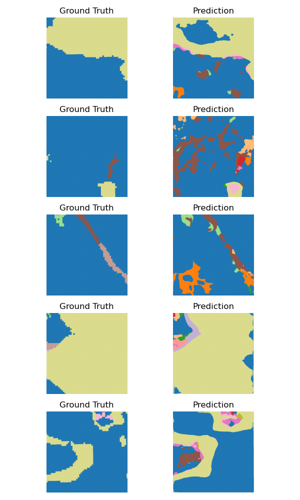

# Wetland Segmentation with ResUNet-ViT

This project performs high-resolution semantic segmentation of wetlands across Europe using a hybrid CNN-ViT architecture trained on 10-meter satellite imagery. It addresses the challenge of weak supervision from coarse-resolution 100-meter labels by applying label-aware loss weighting and boundary enhancement strategies to sharpen spatial accuracy at the native 10 m scale. The dataset exhibits strong class imbalance, which is handled through a combination of focal and class-weighted loss functions, improving minority class detection. It uses weak supervision from 100-meter wetland type labels and powerful spectral-temporal embeddings from Google’s Earth Engine dataset.

---

## 🌍 Datasets

### 🏣 Weak Supervision Labels

* **Source**: European Environment Agency (EEA)
* **Dataset**: [Wetland Types Dataset on EEA DataHub](https://www.eea.europa.eu/en/datahub/datahubitem-view/b9399908-557a-47a8-954a-958dabeaf1b6)
* **Coverage**: Europe-wide (all EU member states + cooperating regions)
* **Format**: Rasterized to 100-meter resolution (FAO Level-3 Wetland Types)
* **Wetland Classes**:

  * No Wetland
  * Rice Fields
  * Riparian, fluvial and swamp broadleaved forest
  * Riparian, fluvial and swamp coniferous forest
  * Riparian, fluvial and mixed forest
  * Managed or grazed wet meadow or pasture
  * Natural seasonally or permanently wet grasslands
  * Wet heaths
  * Riverine and fen scrubs
  * Beaches, dunes, sand
  * Inland marshes
  * Open mires
  * Salt marshes
  * Coastal lagoons
  * River estuaries and estuarine waters of deltas
  * Coastal saltpans (highly artificial salinas)
  * Intertidal flats
  * Surface water

### 🛋️ Input Features

* **Source**: [Google Earth Engine – Satellite Embedding v1](https://developers.google.com/earth-engine/datasets/catalog/GOOGLE_SATELLITE_EMBEDDING_V1_ANNUAL)
* **Description**:

  * Global 64-band spectral-temporal embedding trained via contrastive learning
  * Derived from Sentinel-1, Sentinel-2, and Landsat time series
* **Resolution**: 10 m
* **Coverage**: Europe-wide
* **Selected Features**:

  * 29 pre-selected image channels
  * Selected based on mean feature importance across experiments

---

## 📦 Project Structure

```bash
├── configs/
│   └── config.yaml              # Main configuration file (with {now} placeholders)
├── data/
│   ├── preprocess.py            # Reprojects, resamples, and remaps raster inputs
│   ├── split_data.py            # Generates train/val/test splits
│   ├── dataset.py               # PyTorch dataset class (loads .npy tiles)
│   └── transform.py             # Random flip/rotate augmentation
├── models/
│   └── resunet_vit.py           # Hybrid ResNet+ViT architecture
├── train/
│   ├── train.py                 # Main training script
│   ├── metrics.py               # Computes mIoU, F1, etc.
│   └── losses/
│       ├── focal_tversky.py     # Custom Focal + Tversky loss with boundary masking
│       └── soft_boundary_dice.py# Optional soft boundary-aware Dice loss
├── predict/
│   ├── inference.py             # Patch-based inference with label remapping
│   └── evaluate_predictions.py  # Confusion matrix, metrics CSV
├── scripts/
│   ├── run_train.sh             # Bash script to run preprocessing + training
│   ├── build_vrt.py             # Combines predicted TIFFs into a VRT mosaic
│   └── visualize_predictions.py # Plots input–GT–prediction triplets
├── outputs/
│   └── ...                      # Saved models, logs, predictions
```

---



## 🚀 Quick Start

1. **Clone the repo**

```bash
git clone https://github.com/mkovac03/wetland-segmentation.git
cd wetland-segmentation
```

2. **Install dependencies**

```bash
pip install -r requirements.txt
```

3. **Run training**

```bash
bash run_train.sh
```

4. **Run inference**

```bash
python -m predict.inference --timestamp <TIMESTAMP>
```

---

## 🧠 Model Architecture

The model is a **ResNet-UNet-ViT hybrid** that fuses convolutional and attention-based representations for better segmentation of wetlands. It is specifically designed to handle high-dimensional input features and weak supervision labels at fine spatial resolution, with an emphasis on both local texture and global spatial context.

### 🔧 Key Components

* **Encoder**:

  * Based on ResNet-34 (optional ImageNet pretraining)
  * Modified first convolution to accept 29-band embeddings (e.g., temporal and spectral Earth Engine bands)
  * Sequential feature extraction through residual blocks and max pooling

* **Transformer Bottleneck**:

  * A lightweight Vision Transformer (ViT) bottleneck to capture long-range dependencies
  * Operates on a 16×16 feature map, partitioned into 8×8 tokens using a patch size of 2
  * Configured with 4 transformer layers and 8 attention heads
  * Embedding dimension: 512

* **Decoder**:

  * UNet-style upsampling pathway that mirrors the encoder
  * Skip connections between encoder and decoder levels enable spatial detail recovery
  * Each decoder block performs upsampling (via `ConvTranspose2d`) followed by a ReLU activation
  * The final segmentation map is produced via a 1×1 convolution layer and bilinear upsampling to match the original input resolution

---

## 🧪 Data Augmentation

* Implemented via `RandomFlipRotate`:

  * Random horizontal & vertical flips
  * Random 90°, 180°, 270° rotations
  * Applied only during training, not validation/test

---

## 🛠️ Loss Function

* **Focal Loss**:

  * Downweights easy negatives and emphasizes hard examples using tunable α-γ parameters
  * Includes dynamic class weighting and optional boundary masking for edge precision

* **Tversky Loss**:

  * Generalized Dice variant that handles class imbalance with adjustable α/β weighting
  * Boosts recall for underrepresented and small wetland types

* **Optional Boundary Dice Loss**:

  * Sharpens predictions around fuzzy class edges using distance-transformed masks

* **Combined Objective**:

  * A weighted sum of Focal, Tversky, and optionally Boundary Dice losses
  * Mitigates label imbalance and refines coarse-resolution supervision

---

## 📊 Evaluation & Outputs

* **Metrics**:

  * Per-class and macro F1, mIoU, pixel accuracy
  * Confusion matrix

---

## 📍 Citation

If you use this in your research, please cite:

> Kovács et al. (2025). *High-resolution mapping of wetland types across Europe using CNN-ViT segmentation of satellite embeddings.*

---

## 📬 Contact

For questions or collaboration:

* 🧑‍💻 [Gyula Máté Kovács](https://github.com/mkovac03)
* 🌍 University of Copenhagen · Global Wetland Center
